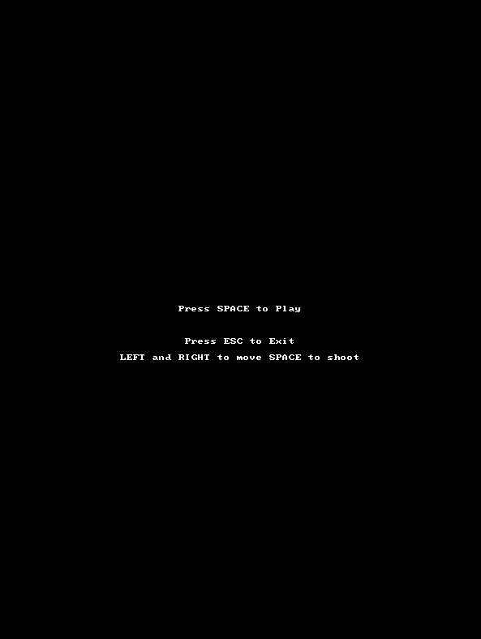
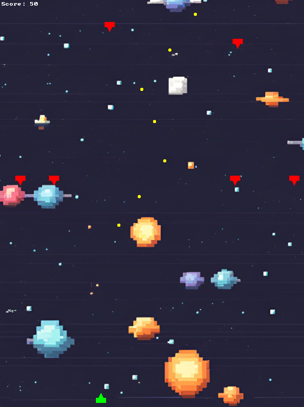
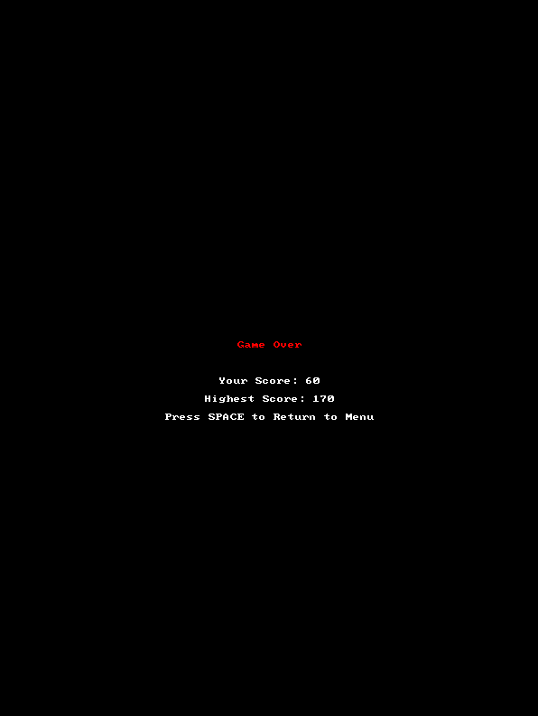

# Space Invaders (C++ & Allegro 5) 👾

Moja implementacja klasycznej gry zręcznościowej Space Invaders. Jest to mój drugi projekt akademicki (2. semestr), napisany w języku C++ z wykorzystaniem biblioteki multimedialnej Allegro 5. 

W tym projekcie przeszedłem z czystego, strukturalnego C na C++, wykorzystując m.in. bibliotekę standardową (STL) i kontenery takie jak `std::vector` do dynamicznego zarządzania falami przeciwników oraz pociskami.

## 🚀 Funkcjonalności
* Płynne poruszanie się statkiem gracza.
* Dynamiczne strzelanie i system detekcji kolizji (pocisk-przeciwnik).
* Zawsze respawnująca się fala 6 przeciwników.
* System naliczania punktów oraz zapisywania najlepszego wyniku (High Score) podczas trwania sesji.
* Proste maszyny stanów gry (Menu główne -> Rozgrywka -> Ekran końcowy).
* Podkład muzyczny w tle oraz grafika otoczenia.

## 🛠️ Wymagania
Projekt został stworzony i skonfigurowany w środowisku Visual Studio. Do poprawnego działania wymaga:
1. Środowiska kompilującego C++.
2. Zainstalowanej biblioteki **Allegro 5** z odpowiednimi modułami (primitives, font, ttf, image, audio, acodec).
3. Dołączonych plików zasobów (`background_image.png` oraz `background_music.wav`) umieszczonych w folderze roboczym.

## ⌨️ Sterowanie
* **Strzałka w lewo** - Ruch statkiem w lewo
* **Strzałka w prawo** - Ruch statkiem w prawo
* **Spacja** - Strzał (w trakcie gry) / Rozpoczęcie gry (w menu)
* **ESC** - Wyjście z gry

## 📸 Zrzuty ekranu

*Ekran startowy z instrukcją dla gracza*

*Klasyczna rozgrywka i zbieranie punktów*

*Ekran końcowy z podsumowaniem wyniku*

